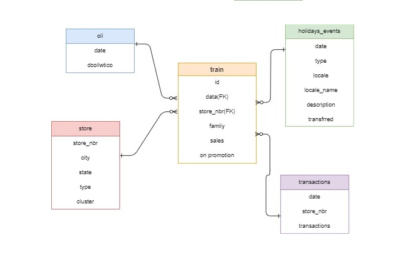

# Kaggle_Competition
## Store Sales - Time Series Forecasting

[Streamlit 링크](https://choijms2-kaggle-storesales-app-a383bo.streamlit.app/) <br/><br/>
[발표 영상]() <br/><br/>
[데모 시연]() <br/><br/>
[포트 폴리오]() <br/><br/>


## 1.프로젝트의 시작 (2023.04.20 ~ 2023.05.17)
- Kaggle Competition : Store Sales - Time Series Forecasting ( Use machine learning to predict grocery sales )
- 링크 : [Kaggle page](https://www.kaggle.com/c/store-sales-time-series-forecasting)
 
## 2. 대회 목표 : 식료품 소매업체의 데이터로 매장 매출을 예측 ( 시계열 예측)
- 여러 매장에서 판매되는 수천 가지 품목의 판매 단가를 더 정확하게 예측하는 모델을 구축
- 날짜, 매장 및 품목 정보, 프로모션, 판매 단가로 구성된 접근하기 쉬운 학습 데이터 세트를 통해 머신 러닝 기술을 연습
- 
## 3. 참여 목적 :
- Python에 대해 공부한 내용을 바탕으로 머신러닝 실습 및 실력향상
- 대시보드 생성능력 향상.
- 시계열 분석 및 회귀 분석 등 통계 지식 향상

## 4. ERD (개체 관계 모델)


## 5. 팀 구성
- 사용언어 : Python : 3.9.13v
- 작업툴 : Pycharm
- 인원 : 4명
- 주요 업무 : Streamlit 라이브러리를 이용한 웹개발 구현 코드 작성 및 머신러닝을 활용한 매장 매출 예측
- 기간 : 2023.04.20 ~ 2023.05.17
***

## 6. 주요 기능
- 
    + ㅇㄹ
## 7. 설치 방법
### Windows
+ 버전 확인
    - vscode : 1.74.1
    - python : 3.9.13
    - 라이브러리 : pandas (1.5.3), numpy (1.23.5), plotly (5.14.1), matplotlib (3.7.1), streamlit (1.21.0), seaborn (0.12.2), pingouin (0.5.3), statsmodels (0.13.2), scikit-learn (1.2.2), xgboost (1.7.5), pandas-profiling (3.6.3), streamlit-option-menu (0.3.2), streamlit_pandas_profiling (0.1.3), scipy(1.9.1), 


- 프로젝트 파일을 다운로드 받습니다. 

```bash
git clone https://github.com/ChoiJMS2/Kaggle_StoreSales.git
```

- 프로젝트 경로에서 가상환경 설치 후 접속합니다. (Windows 10 기준)
```bash
virtualenv venv
source venv/Scripts/activate
```

- 라이브러리를 설치합니다. 
```bash
pip install -r requirements.txt
```

- streamlit 명령어를 실행합니다. 
```bash
streamlit run app.py
```

# 내방 어디? v2(2023.02.02~)

## 주요 기능 업데이트 내용
- 홈페이지
    - 실거래 현황(최근 한달순)
    - 전세 월평균, 월세 월평균 추이 꺾은선그래프 **시각화**
    - 월세, 전세 실거래 수 지역 순위 막대그래프 **시각화**
- 전월세 검색페이지
    - 전/월세 구분 검색 중 모두 검색할 수 있도록 **추가**
    - 보증금, 월세, 임대면적 최소/최대값 정해줄 수 있도록 **추가**
    - 보증금, 월세, 임대면적 최소/최대값과 슬라이더값 **동기화**

- 전세 예측페이지
    - 날짜 선택 후 지역구별 평균 실거래가 지도 **시각화**

- 건의사항페이지
    - 처리 상태 **추가**
    - 빈칸 입력시 에러메시지 **추가**
    - 관리자 기능
        - 처리 상태 변경 기능 **추가**
    - 검색 기능
        - 제목, 작성자명, 내용에 같은 내용 검색 기능 **추가**